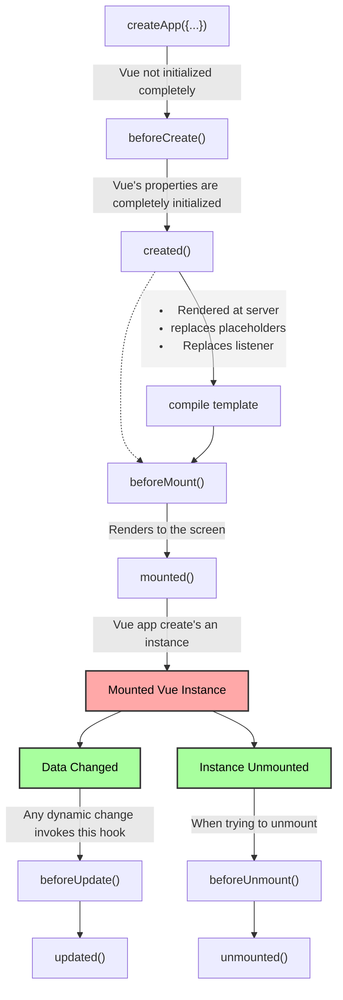

## Basics of vue js

### Interpolation {{}}

it gets all the returned key values from data()

### methods vs computed vs watch

| Methods                                                                       | Computed                                                                        | Watch                                                                                                                      |
| ----------------------------------------------------------------------------- | ------------------------------------------------------------------------------- | -------------------------------------------------------------------------------------------------------------------------- |
| Use with event binding or data binding                                        | Use with data binding                                                           | not used directly in template                                                                                              |
| Data binding: method is executed for every "re-render" cycle of the component | Computed properties are only re-evaluated if one of their "used values" changed | Allows you to run any code in reaction to some changed data (e.g data specific action like reset counter or Http requests) |
| Use for `events` or `data` that really need to be re-evaluated all the time   | Use for data that `depends on other data`                                       | Use for any `non-data` update you want to make                                                                             |

## shorthands

1. v-on:event_name -> @:event_name
2. v-bind:attribute_name -> :attribute_name

## How vue updates the DOM

First it creates a virtual DOM, then when the data changes, it creates a new virtual DOM and compares it with the old one. Then it updates the real DOM with the changes. As this happens in the RAM and not in the real DOM, it is very fast.

## How vue is reactive

Vue uses the javascript's proxy object to make the data reactive. It listens to the changes in the data and updates all bouned elements.

## ref

`ref` is used to get the reference of the element in the DOM. It is used to access the element in the DOM.

like

```html
<input
	type="text"
	ref="myInput"
/>
```

```javascript
let var = this.$refs.myInput;
// this var will have the reference of the input element so all the attributes and values
```

## Vue instance lifecycle hooks


