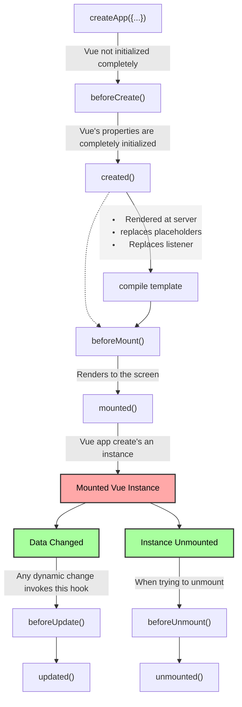

## Basics of vue js

### Interpolation {{}}

it gets all the returned key values from data()

### methods vs computed vs watch

| Methods                                                                       | Computed                                                                        | Watch                                                                                                                      |
| ----------------------------------------------------------------------------- | ------------------------------------------------------------------------------- | -------------------------------------------------------------------------------------------------------------------------- |
| Use with event binding or data binding                                        | Use with data binding                                                           | not used directly in template                                                                                              |
| Data binding: method is executed for every "re-render" cycle of the component | Computed properties are only re-evaluated if one of their "used values" changed | Allows you to run any code in reaction to some changed data (e.g data specific action like reset counter or Http requests) |
| Use for `events` or `data` that really need to be re-evaluated all the time   | Use for data that `depends on other data`                                       | Use for any `non-data` update you want to make                                                                             |

## shorthands

1. v-on:event_name -> @:event_name
2. v-bind:attribute_name -> :attribute_name

## How vue updates the DOM

First it creates a virtual DOM, then when the data changes, it creates a new virtual DOM and compares it with the old one. Then it updates the real DOM with the changes. As this happens in the RAM and not in the real DOM, it is very fast.

## How vue is reactive

Vue uses the javascript's proxy object to make the data reactive. It listens to the changes in the data and updates all bouned elements.

## ref

`ref` is used to get the reference of the element in the DOM. It is used to access the element in the DOM.

like

```html
<input type="text" ref="myInput" />
```

```javascript
let var = this.$refs.myInput;
// this var will have the reference of the input element so all the attributes and values
```

## Vue instance lifecycle hooks



## How emit works

`$emit` is used to emit an event from the child component to the parent component. It is used to send data from child to parent.

- We define a custom `event name` in the child component.
- We listen to that event in the parent component using `@event_name`.
- We define a function in the parent component to handle the data sent by the child component.
  - which is attached as `@event_name="function_name"`.

```javascript
// child component
this.$emit("event_name", data);
```

```html
// parent component
<child-component @event_name="function_name"></child-component>
```

```javascript
// parent component
function_name(data) {
    console.log(data);
}
```

## Fragments in vue2 vs vue3

The surface level tags inside `template` are called fragment. In vue2 inside template we could use only a single fragment inside it. But vue3 supports multiple fragment.

```html
<template>
	<h1>Header 1</h1>
	<h2>Header 2</h2>
	<input type="text" />
</template>
```

The above syntax is not supported in vue2 because template has more than one tag/ fragment inside it's surface level. But vue3 allows it. To do the same thing in vue2 we had to wrap this in a `div` tag like below

```html
<template>
	<div>
		<h1>Header 1</h1>
		<h2>Header 2</h2>
		<input type="text" />
	</div>
</template>
```

## router-link-active vs router-link-exact-active

- The exact-active means exactly the url matches in the `<RouterLink to="address">` address
- but active means any nested route originate from the route also implies the route is active

for example

```HTML
<RouterLink to="/users"/>
```

then is route `/users` we get `both` active and exactive attribute
but in `/users/details` we get `only` active tag.

## route vs router

We can achieve both variable after `npm install` one everywhere and the other to those component where we navigated to.

### route methods accessing $this.route.method_name

| Method   | Description                                                                         |
| -------- | ----------------------------------------------------------------------------------- |
| params   | object containing key/value pairs of the route params                               |
| query    | object containing key/value pairs of the query string                               |
| hash     | the hash of the current route                                                       |
| fullPath | the full resolved URL including query and hash                                      |
| matched  | an array containing route records for all nested path segments of the current route |

### router methods accessing $this.router.method_name

| Method               | Description                                                                         |
| -------------------- | ----------------------------------------------------------------------------------- |
| push                 | navigate to a different URL. The current page will be added to the history stack    |
| replace              | navigate to a different URL. The current page will be replaced in the history stack |
| go                   | navigate to a specific position in the history stack                                |
| back                 | equivalent to go(-1)                                                                |
| forward              | equivalent to go(1)                                                                 |
| getMatchedComponents | returns an array of the components matched by the current route                     |
